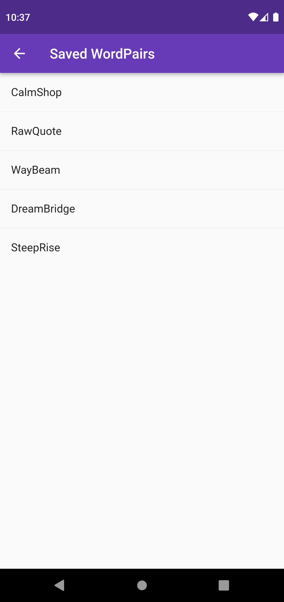

# WordPair Generator

This is a flutter app in which random word pairs automatically generated are displayed and we can select and bookmark any word pairs which we like.

The bookmarked items can be seen in a separate menu, which can be accessed from the menu icon on the top right side of the app window.

## ⚙ Tech Stack Used

- Flutter
- Dart

## 📸 Screenshots
 
<!--  -->

	
  
  

